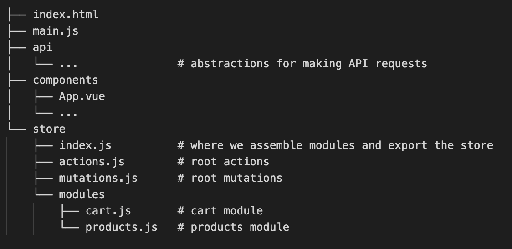

source $(brew --prefix nvm)/nvm.sh 

# sochma_front

## Application Structure



├── index.html
├── main.js
├── api
│   └── ...               # abstractions for making API requests
├── components
│   ├── App.vue
│   └── ...
└── store
    ├── index.js          # where we assemble modules and export the store
    ├── actions.js        # root actions
    ├── mutations.js      # root mutations
    └── modules
        ├── cart.js       # cart module
        └── products.js   # products module

## Recommended IDE Setup

[VSCode](https://code.visualstudio.com/) + [Volar](https://marketplace.visualstudio.com/items?itemName=Vue.volar) (and disable Vetur).

## Customize configuration

See [Vite Configuration Reference](https://vitejs.dev/config/).

## Project Setup

```sh
npm install
```

### Compile and Hot-Reload for Development

```sh
npm run dev
```

### Compile and Minify for Production

```sh
npm run build
```


source $(brew --prefix nvm)/nvm.sh    